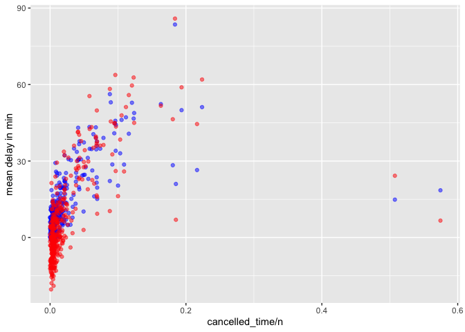

HW 1 433
================

1.  8255 are missing from dep_time,8255 missing in dep-delay, arr_time
    has 8713 missing, arr_delay has 9430 missing, and air_time has 9430
    missing. These indicate that there are no value in that certain
    slot. The plain could have be canceled or never took off for some
    reason or the data could be lost and these are just normal flights.

``` r
library(nycflights13)
library(ggplot2)
library(dplyr)
```

    ## 
    ## Attaching package: 'dplyr'

    ## The following objects are masked from 'package:stats':
    ## 
    ##     filter, lag

    ## The following objects are masked from 'package:base':
    ## 
    ##     intersect, setdiff, setequal, union

``` r
summary(flights)
```

    ##       year          month             day           dep_time    sched_dep_time
    ##  Min.   :2013   Min.   : 1.000   Min.   : 1.00   Min.   :   1   Min.   : 106  
    ##  1st Qu.:2013   1st Qu.: 4.000   1st Qu.: 8.00   1st Qu.: 907   1st Qu.: 906  
    ##  Median :2013   Median : 7.000   Median :16.00   Median :1401   Median :1359  
    ##  Mean   :2013   Mean   : 6.549   Mean   :15.71   Mean   :1349   Mean   :1344  
    ##  3rd Qu.:2013   3rd Qu.:10.000   3rd Qu.:23.00   3rd Qu.:1744   3rd Qu.:1729  
    ##  Max.   :2013   Max.   :12.000   Max.   :31.00   Max.   :2400   Max.   :2359  
    ##                                                  NA's   :8255                 
    ##    dep_delay          arr_time    sched_arr_time   arr_delay       
    ##  Min.   : -43.00   Min.   :   1   Min.   :   1   Min.   : -86.000  
    ##  1st Qu.:  -5.00   1st Qu.:1104   1st Qu.:1124   1st Qu.: -17.000  
    ##  Median :  -2.00   Median :1535   Median :1556   Median :  -5.000  
    ##  Mean   :  12.64   Mean   :1502   Mean   :1536   Mean   :   6.895  
    ##  3rd Qu.:  11.00   3rd Qu.:1940   3rd Qu.:1945   3rd Qu.:  14.000  
    ##  Max.   :1301.00   Max.   :2400   Max.   :2359   Max.   :1272.000  
    ##  NA's   :8255      NA's   :8713                  NA's   :9430      
    ##    carrier              flight       tailnum             origin         
    ##  Length:336776      Min.   :   1   Length:336776      Length:336776     
    ##  Class :character   1st Qu.: 553   Class :character   Class :character  
    ##  Mode  :character   Median :1496   Mode  :character   Mode  :character  
    ##                     Mean   :1972                                        
    ##                     3rd Qu.:3465                                        
    ##                     Max.   :8500                                        
    ##                                                                         
    ##      dest              air_time        distance         hour      
    ##  Length:336776      Min.   : 20.0   Min.   :  17   Min.   : 1.00  
    ##  Class :character   1st Qu.: 82.0   1st Qu.: 502   1st Qu.: 9.00  
    ##  Mode  :character   Median :129.0   Median : 872   Median :13.00  
    ##                     Mean   :150.7   Mean   :1040   Mean   :13.18  
    ##                     3rd Qu.:192.0   3rd Qu.:1389   3rd Qu.:17.00  
    ##                     Max.   :695.0   Max.   :4983   Max.   :23.00  
    ##                     NA's   :9430                                  
    ##      minute        time_hour                  
    ##  Min.   : 0.00   Min.   :2013-01-01 05:00:00  
    ##  1st Qu.: 8.00   1st Qu.:2013-04-04 13:00:00  
    ##  Median :29.00   Median :2013-07-03 10:00:00  
    ##  Mean   :26.23   Mean   :2013-07-03 05:22:54  
    ##  3rd Qu.:44.00   3rd Qu.:2013-10-01 07:00:00  
    ##  Max.   :59.00   Max.   :2013-12-31 23:00:00  
    ## 

2.  We can use the following code to transform the current data into min

``` r
flight_time = mutate(flights,
                  dep_time_min =(dep_time %/% 100 * 60 + dep_time %% 100) %% 1440,
                  sched_dep_time_min = (sched_dep_time %/% 100 * 60 + sched_dep_time %% 100) %% 1440)

select(flight_time, dep_time, sched_dep_time, dep_time_min,sched_dep_time_min)
```

    ## # A tibble: 336,776 × 4
    ##    dep_time sched_dep_time dep_time_min sched_dep_time_min
    ##       <int>          <int>        <dbl>              <dbl>
    ##  1      517            515          317                315
    ##  2      533            529          333                329
    ##  3      542            540          342                340
    ##  4      544            545          344                345
    ##  5      554            600          354                360
    ##  6      554            558          354                358
    ##  7      555            600          355                360
    ##  8      557            600          357                360
    ##  9      557            600          357                360
    ## 10      558            600          358                360
    ## # … with 336,766 more rows

3.  We can see that the gg plot does not really show there is a strong
    correlation between the 2 varb with only a couple of outliers
    spreaded to the RHS of the plot

``` r
flights %>%
  mutate(dep_date = lubridate::make_datetime(year, month, day)) %>%
  group_by(dep_date) %>%
  summarise(cancelled_time = sum(is.na(dep_delay)), 
            n = n(),
            average_dep_delay = mean(dep_delay,na.rm=T),
            average_arr_delay = mean(arr_delay,na.rm=T)) %>%
  ggplot(aes(x= cancelled_time/n))  +
  geom_point(aes(y=average_dep_delay), color='blue', alpha=0.5) +
  geom_point(aes(y=average_arr_delay), color='red', alpha=0.5)  +
  ylab('mean delay in min')
```

<!-- -->
